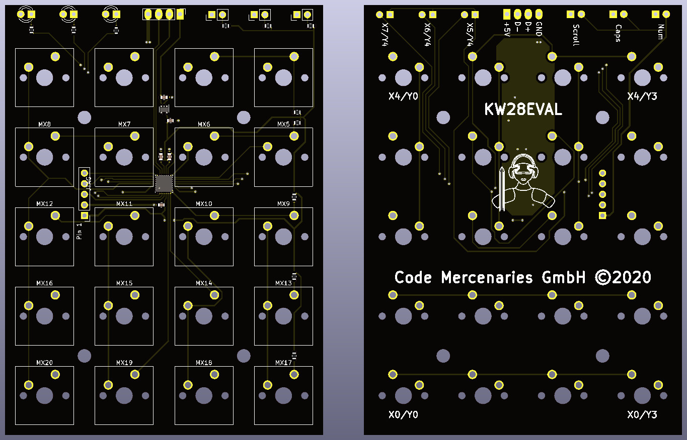
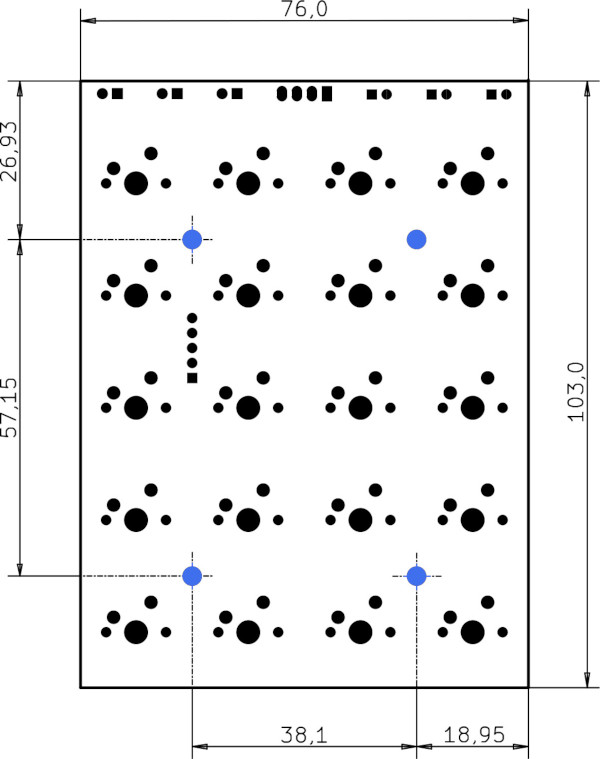

# KeyWarrior28EVAL board accessories
This repository contains the 3D print data for case, keycaps and other parts to support the KeyWarrior28EVAL. 
All 3D models are created with [FreeCAD](https://www.freecadweb.org/) and are available in *.FCStd and *.STL format. 

# Description of KeyWarrior28EVAL board
The [KW28EVAL](https://shop.codemercs.com) is an evaluation PCB for the KeyWarrior28 universal keyboard controller by Code Mercenaires. It has space for 20 MX-type keys in a 4x5 arrangement plus 3 seperate switches off board. 
The footprint for the mechanical keys is for switches compatible with the Cherry-MX 5 pin layout (without diode or LED pins). 
Solder positions for status LEDs (NUM, LOCK, SCROLL), USB, and the optional 3 switches are at the top of the board. 
The dimensaions of the PCB are 103mm high by 76mm wide, thickness without the keys is less than 3 mm.

# Images of PCB

# Description of KeyWarrior28
[KeyWarrior28](https://www.codemercs.com) is a keyboard controller supporting a 8x8 matrix (64 keys maximum). The key table with 3 layers is fully programmable via USB. 
Every single key can be programmed with either a single key code, a key code plus one modifier (shift, ctrl, alt, gui), a macro (19 macros with up to 31 key codes available), a mouse function, a media/application control, or a FN key. 
KeyWarrior28 supports up to 19 macros in different modes: static, typing, and cell mode. The keytable can be programmed with our free software "[KW28 Editor](https://codemercs.com/downloads/keywarrior/KW28_Editor.zip)" for Windows.

# External links
**Shoplink** to buy your KW28Eval board (available soon): https://shop.codemercs.com/ 
**Product page** for KW28Eval: https://codemercs.com/en/keyboard/8x8-matrix 
**Datasheets** for the KW28: https://codemercs.com/downloads/keywarrior/KW28_Datasheet.pdf 
**Instructions** for KW28Eval: https://codemercs.com/downloads/keywarrior/KW28EVAL_Instructions.pdf 
**Software** to program key tables of KW28Eval (for Windows): https://codemercs.com/downloads/keywarrior/KW28_Editor.zip 

# FAQ
Please take a look at the [FAQ](https://github.com/codemercs-com/KW28-Eval/wiki/FAQ) section in this repository.

# Contact and support
If you have any questions or need support please contact support@codemercs.com or visit our [forum](https://forum.codemercs.com)

